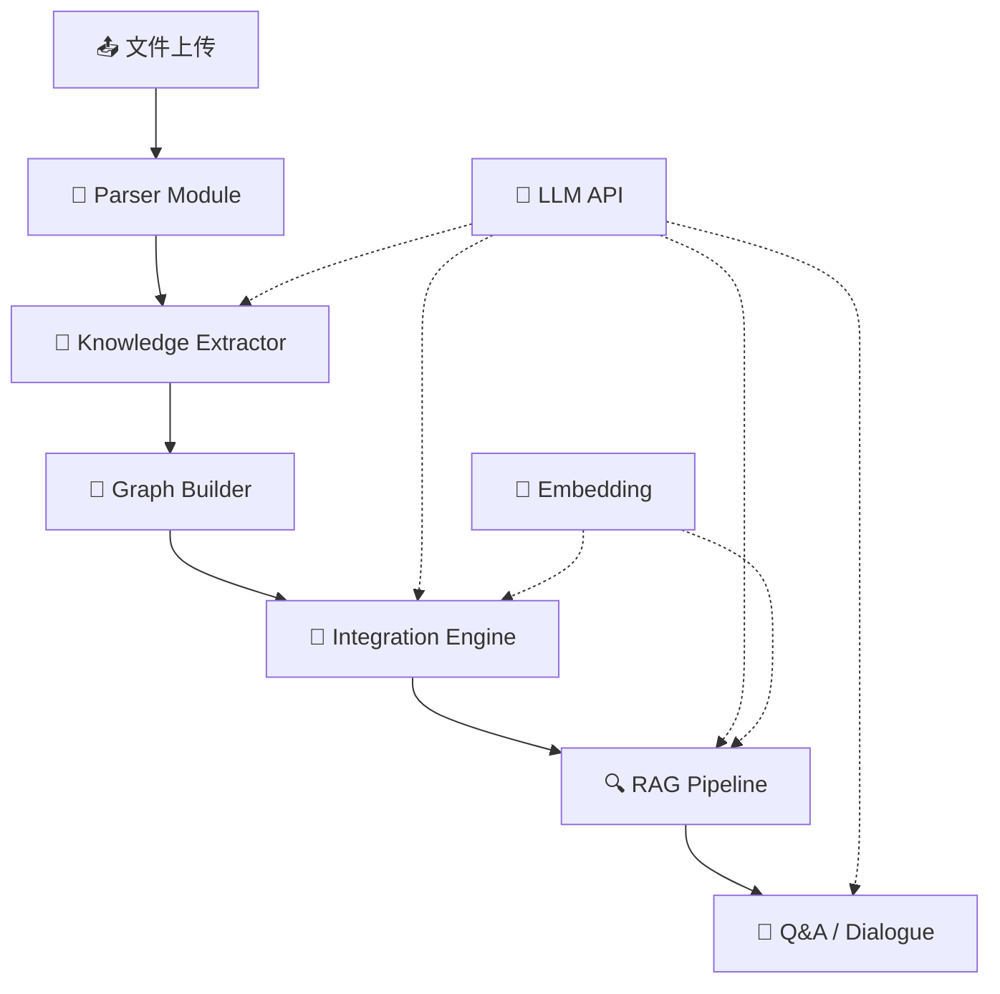

# Agent 架构说明

> 学科知识整合智能体 — Agent 设计决策与论证

## 1. 架构总览

本系统采用 **单 Agent + 模块化 Pipeline** 架构。



## 2. 设计决策论证

### 为什么选择单 Agent 架构？

1. **5 小时时间限制**: 多 Agent 的协调、通信、错误处理开销大，单 Agent 流水线更易实现和调试
2. **任务线性依赖**: 解析→提取→图谱→整合→RAG，各阶段有明确的上下游关系
3. **LLM 调用统一**: 所有 LLM 调用通过同一接口 + 不同 Prompt 模板实现
4. **评分导向**: 赛题明确"论证充分的单 Agent 可以比硬拆的多 Agent 得分更高"

### Agent 职责边界

- **Parser**: 纯工程逻辑，不涉及 LLM
- **Knowledge Extractor**: LLM 调用，Prompt 模板化
- **Integration Engine**: Embedding 计算 + 规则决策
- **RAG Pipeline**: Chunk + Embed + FAISS + LLM Generate
- **Dialogue**: LLM 多轮对话，上下文管理

## 3. 数据流与调用链路

```
上传 PDF → parse_pdf() → TextbookInfo
    → build_knowledge_graph(book) → {nodes, edges}
    → integrate_graphs(graphs) → IntegrationResult
    → TextChunker → VectorIndex.index()
    → rag_query(question) → RAGResponse
    → dialogue.chat(msg) → reply
```

## 4. 取舍与权衡

### 放弃的方案

| 方案 | 原因 |
|------|------|
| LangGraph 多 Agent | 学习曲线陡，5 小时不够 |
| React 前端 | Gradio 更快，Python 全栈 |
| ChromaDB | FAISS 更轻量，无服务依赖 |
| BM25 混合检索 | 先保证基础 Pipeline 跑通 |

### 已知局限

- **知识提取质量**: 依赖 LLM 输出稳定性，Prompt 注入风险
- **语义对齐**: Embedding 阈值固定，可能漏匹或误匹
- **图谱规模**: 前端渲染限制 ≤ 200 节点
- **对话持久化**: 当前仅内存存储，重启丢失

### 改进方向

- 引入 Rerank 提升检索精度
- 支持 Ollama 本地模型降低成本
- Docker 一键部署
- 图谱多视图切换（树状图/桑基图）

## 5. Prompt 工程

### 知识提取 Prompt 设计

- **System**: 角色设定 + JSON 格式约束 + category 枚举
- **User**: 教材名 + 章节名 + 内容（截断 3000 字）
- **防幻觉策略**: 明确要求"只提取章节中确实出现的知识点"

### RAG 生成 Prompt 设计

- **System**: 严格约束"只基于上下文回答"
- **User**: 检索到的 Chunk + 问题
- **引用格式**: [教材名, 章节, 页码]

## 6. 创新点

1. **单 Agent 精细编排**: 不依赖框架，手动管理每个 LLM 调用的上下文
2. **模块化 Prompt 模板**: 每个阶段独立 Prompt，易于调试和优化
3. **Embedding 双重对齐**: 名称匹配 + 语义相似度，兼顾准确率和召回率
4. **ECharts 力导向图**: 支持缩放/拖拽/节点高亮，视觉区分教材来源和知识点频次
