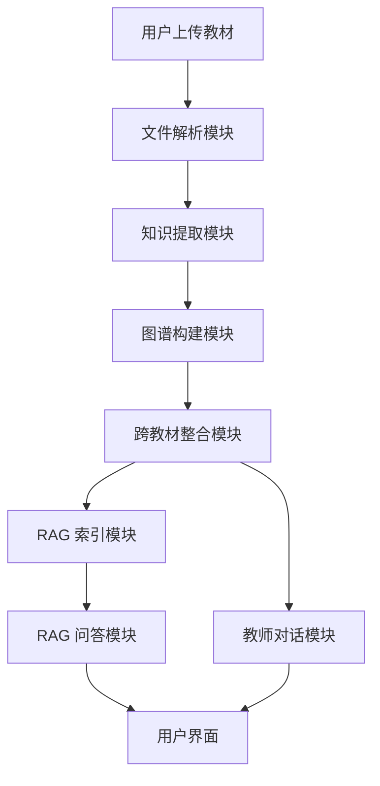

# 系统设计

> 学科知识整合智能体 — 架构设计、数据流、技术选型

## 1. 架构总览

## 2. 数据流

1. **上传**: 用户上传 PDF/MD/TXT → 保存到 `data/uploads/`
2. **解析**: 逐页提取文本 → 章节识别 → 结构化 JSON
3. **提取**: 每章调用 LLM → 知识点节点 + 关系边
4. **图谱**: 节点+边 → ECharts 力导向图可视化
5. **整合**: Embedding 语义对齐 → merge/keep/remove 决策
6. **索引**: Chunk(600字) → Embed → FAISS
7. **问答**: 用户提问 → 检索 Top-5 → LLM 生成(带引用)
8. **对话**: 教师反馈 → 调整整合决策

## 3. 技术选型

| 模块 | 技术 | 理由 |
|------|------|------|
| 前端框架 | Gradio | 快速构建，Python 原生，无需写 JS |
| 文件解析 | PyMuPDF | 中文 PDF 支持好，章节识别准确 |
| LLM | OpenAI/通义千问/DeepSeek | API 兼容，按需切换 |
| Embedding | sentence-transformers | 本地免费，支持中文 |
| 向量检索 | FAISS | 轻量 CPU 可用 |
| 可视化 | ECharts | 成熟稳定，力导向图效果好 |

## 4. API 接口一览

| 方法 | 路径 | 说明 |
|------|------|------|
| POST | `/upload` | 上传教材文件 |
| GET | `/textbooks` | 列出已上传教材 |
| GET | `/graph/{id}` | 获取单本教材图谱 |
| POST | `/integrate` | 执行跨教材整合 |
| POST | `/rag/index` | 建立 RAG 索引 |
| POST | `/rag/query` | RAG 问答 |
| POST | `/chat` | 教师对话 |
